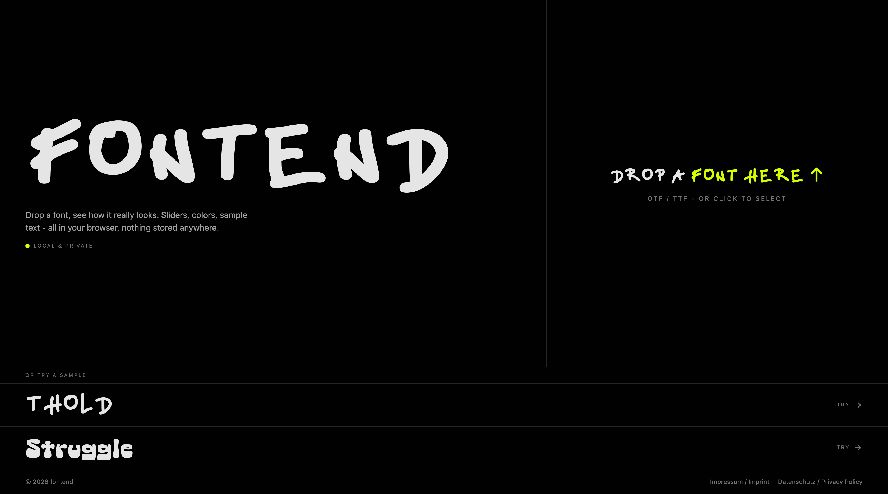

# fontend

A font tester that runs entirely in your browser. Drop an OTF/TTF, play with size, line height, letter spacing, colors, and sample text - see how the font really looks before you commit to it.



## Why

Most font testers show you the glyphs on a plain white page and call it a day - you can't really tell how a typeface will hold up in the actual context you'll use it in. fontend lets you freely play with **font color and background color** alongside size, spacing, and line height, so you can see how the type behaves on the surface it'll actually live on - dark UI, brand pastel, high-contrast print, whatever. That's the part most tools skip.

On top of that: the font you drop never leaves your browser. It's parsed locally via the [FontFace Web API](https://developer.mozilla.org/en-US/docs/Web/API/FontFace) and [opentype.js](https://github.com/opentypejs/opentype.js), and discarded the moment you close the tab. No uploads. No cookies. No tracking. No analytics. Just typography.

## Features

- Drop or pick an OTF/TTF file
- Live sliders for font size, line height, letter spacing, word spacing
- Editable preview area - type your own text in the actual font
- Color picker for foreground and background
- Metadata view: family, designer, license, version, glyph count and more
- Two bundled sample fonts (Thold, Struggle) for quick play
- Switch between sample fonts or your own at any time without reloading

## Tech stack

- [React 19](https://react.dev) + [TypeScript](https://www.typescriptlang.org/)
- [Vite](https://vite.dev) for bundling
- [Tailwind CSS v4](https://tailwindcss.com)
- [opentype.js](https://github.com/opentypejs/opentype.js) for parsing font metadata

## Run locally

```bash
npm install
npm run dev
```

Open http://localhost:5173.

## Build

```bash
npm run build
```

Outputs a static bundle to `dist/`. Deploy that anywhere - no server, no environment variables, no special routing rules required.

## Project layout

```
src/
  App.tsx         the whole app - landing, preview, sliders, routing
  font.ts         opentype.js wrapper: load fonts from File or URL
  index.css       Tailwind import, @font-face declarations
  legal/
    config.ts     legal contact info and other stuff
    Impressum.tsx
    Datenschutz.tsx
public/
  example_fonts/  bundled sample fonts (SIL OFL)
  favicon-*.svg
  landing-screenshot.png
```

## Credits

- **Thold** by Kim A. Nguyen - [SIL Open Font License](public/example_fonts/Thold/OFL.txt)
- **Struggle** by falk - [SIL Open Font License](public/example_fonts/struggle%201_0/OFL.txt)
